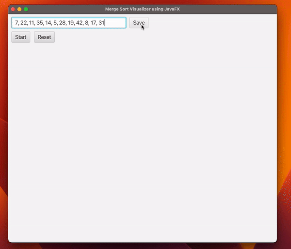

<h1>Merge Sort Visualizer 🚀</h1>

This **Merge Sort Visualizer** is a Java application that allows you to visually understand the Merge Sort algorithm. Merge Sort is a popular sorting algorithm known for its efficiency and stability.

The visualizer provides a graphical representation of the array being sorted at each step of the Merge Sort process. This makes it easier to comprehend how the algorithm divides and conquers the array, ultimately sorting it in ascending order.

<h2>Features ✨</h2>

Visual representation of the Merge Sort algorithm.
Step-by-step visualization of the sorting process.
Adjustable array size for testing different scenarios.
Smooth animation to enhance understanding.

<h2>How to Use 🛠️</h2>

Clone this repository to your local machine.
Open the project in your favorite Java IDE. <br>

```Compile and run the mainApplication.java file.```

Adjust the array size and other parameters as needed.
Watch as the Merge Sort algorithm sorts the array, step by step, with visual feedback.

<h2>Technologies Used 🛠️</h2>

```Java, JavaFx```

Screenshots 📸



<h2>Contributing 🤝</h2>

Contributions are welcome! Feel free to open issues or pull requests to suggest improvements, report bugs, or add new features.

<h2>License 📝</h2>

This project is licensed under the MIT License - see the LICENSE file for details.